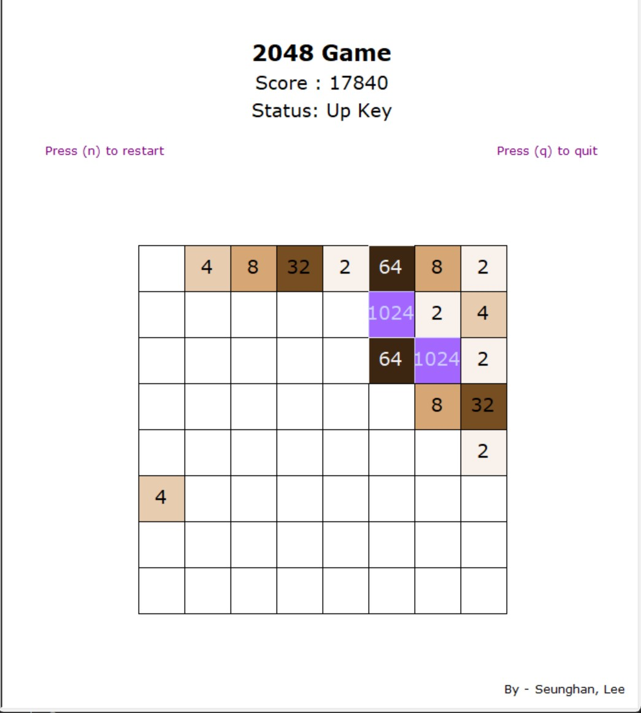
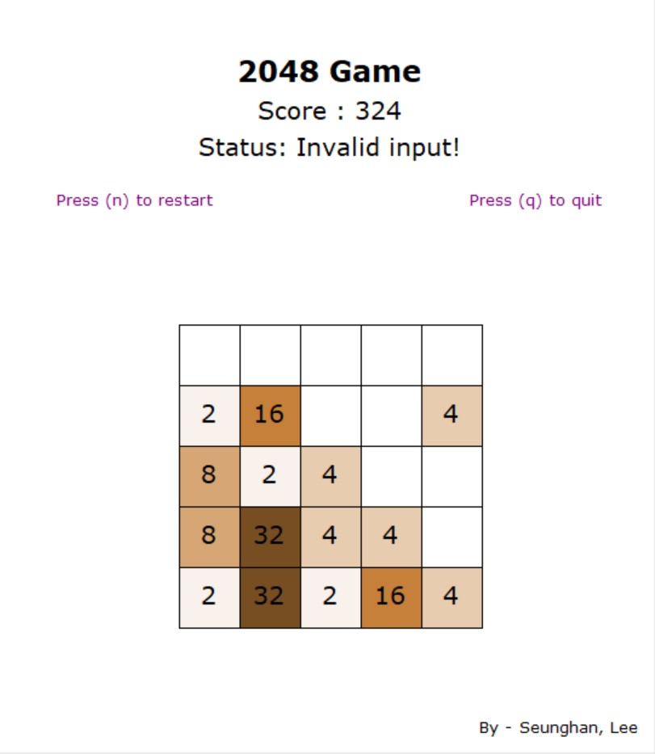
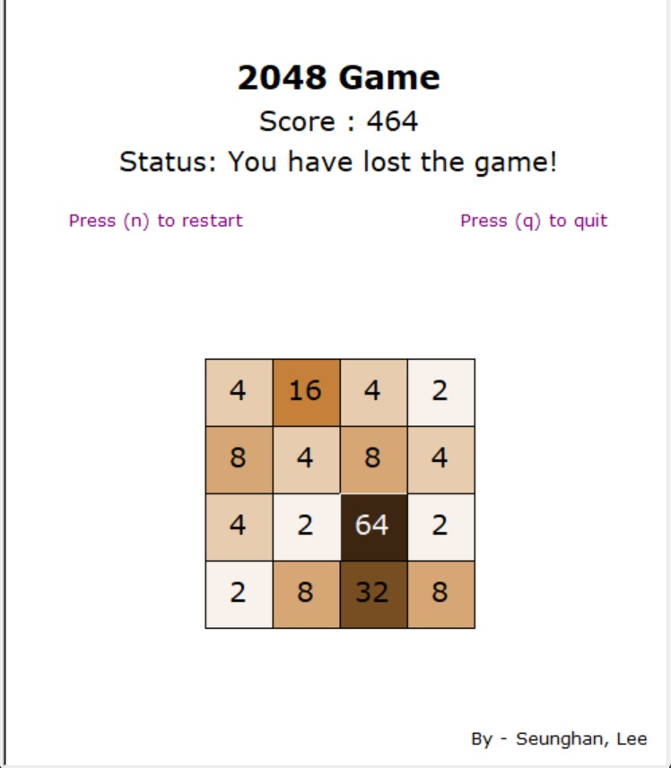
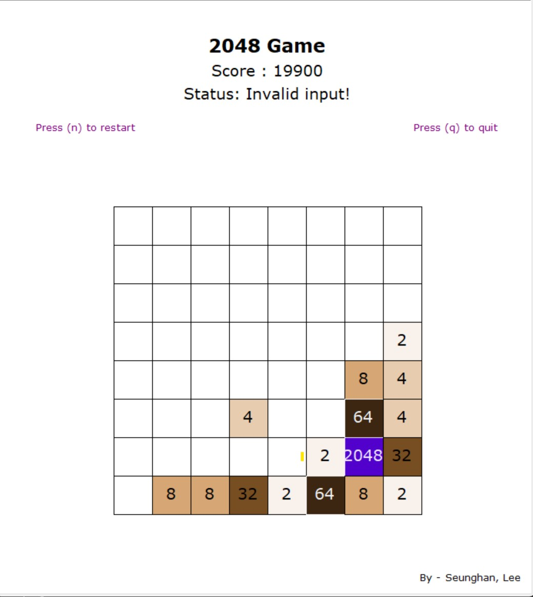

<h1 align="center"> 2048 Game - from scratch </h1>
<p align="center">
    
    <br>
    <i>Sample Game Screen</i>
</p>

<!-- START doctoc generated TOC please keep comment here to allow auto update -->
<!-- DON'T EDIT THIS SECTION, INSTEAD RE-RUN doctoc TO UPDATE -->
# Table of Contents

- [About](#About)
- [Libraries](#Libraries)
- [How to run the program](#how-to-run-the-program)
- [Implementation](#implementation)
- [Features (Summary)](#features-summary)
- [More Game Screens](#more-game-screens)

<!-- END doctoc generated TOC please keep comment here to allow auto update -->

<br>

# About

<i> Note: 2048 game has been implemented from scratch as part of the final project for the CS5001 course in Northeastern University. </i> 

## General 
This program is an implementation of <a href="https://play2048.co/"> 2048 game</a> in Python. Unlike the typical 2048 game, user can choose the size of the board at the start of the game. When the program starts, the program takes player's input within the range between 4 to 8, inclusive, to decide the size of the matrix that user will play with. (i.e. User input of 4 will create a matrix size of 4 x 4, while 6 will create a matrix size of 6 x 6)

Just like the original 2048 game, player can press four directional arrow key to swipe the board to each of four directions. Each swipe will move all existing cells filled with number to the direction pressed and merge the cells if two of the adjacent numbers are the same. For each merge, the score will increase by the sum of value in the merged cells. It would not merge recursively like the original 2048 game.

Each of the four directional arrow keys, 'N' and 'Q' are valid keys. Player can restart the game by pressing 'N' key and quit the game pressing 'Q' key. For each key input, user can see changing messages on the screen. For each directional input, if the matrix has at least one cell that is not filled with a number, 2 or 4 will randomly generated. 

## Goal
The goal of the game is to merge the cell upto 2048. To make the game harder, your goal is to merge the cell upto 2048 with the minimum score. When the player reaches 2048, the screen will display the quote "You have won the game!". If all the cells in the matrix is filled with numbers, and no marginal move can change the state of the matrix, user loses the game and the screen will display "You have lost the game!".

<br>

# Libraries
This project uses turtle library for rendering the screen. All the other classes and functions are implemented from scratch.

<br>

# How to run the program
As main.py is the main entry for the program, you may run the program by typing in the following command in CLI.
```
python main.py
```

<br>

# Implementation

## General Flow
main.py file is the main entry for the program, where Game class is instantiated based on the user input of the matrix size and passes onto the Game class(Controller in MVC software pattern) by calling start method of the Game class. start method in the game class will create an instance of Board class(Model in MVC software pattern) and passes onto Renderer class(View in MVC software pattern).

## Board (Model)
Board class can be described as the Model in the commonly used software design pattern. Board class contains attributes including matrix, size, status and score. Board class methods uses function in the utils.py file to support the general matrix manipulation, including generate, swipe, rotate, update, reset and etc. Each matrix manipulation methods mutates the matrix in-place for space efficiency. 

To support all four directional matrix manipulation, this program first rotates the matrix to position the matrix that a single left to right swipe method can support all four directional matrix manipulation. For each arrow key input initial number of rotation and subsequent rotation after swipe is as follows;

| **_Direction_** | Initial Rotation | Post Swipe Rotation |
|-----------------|------------------|---------------------|
|      Right      | 0                | 0                   |
|        Up       | 1                | 3                   |
|       Left      | 2                | 2                   |
|       Down      | 3                | 1                   |

Each swipe is composed of following operations;
1) initial rotation: rotate to support left to right swipe
2) slide: move all the existing cells with numbers to the right
3) merge: merge two cells with equivalent value, if any
4) slide: slide again to fill in the space with None value after merge
5) update the score
6) subsequent rotation: rotate back to initial state

<i>Details of each operations can be found in the docstring included in the utils.py file.</i>

## Renderer (View)
Renderer class can be described as the Viewer in the commonly used software design pattern. Renderer uses Python built-in library, turtle, to display screen based on user input. Initialize method will set width and height of the screen according to the user's input of the matrix size, and setup turtle.

Once initialized, eventloop will be started and the program would listen for user input. For each input, state varables including status message and score will be updated accordingly. Each call to the render method takes following operation;
1) Clear the previous screen
2) Update the screen with the new Board class instance
3) Write text
4) Draw Matrix

Included texts are as follows;
1) title - top mid
2) score - top mid, below title
3) status - top mid, below score
4) instructions - top left and right, below status
5) name - bottom right 

Matrix is drawn by moving the turtle from top left corner of the matrix to the bottom left corner of the matrix, drawing single cell for each row.

## Game (Controller)
Board class can be described as the Controller in the commonly used software design pattern. Board class will create a Board class and passed the class created instance to the Renderer class. It initializes render and starts event loop to listen for the userr input.

# Features (Summary)
* Player can decide the board size
* Color varies depending on the number included in the cell
* Messages changes based on the user input
* Score is updated for each turn and displayed in the screen

<i>You may find the detailed explanation of features above</i>

# More Game Screens
<p align="center">
    
    <br>
    <i>- Sample Invalid Input Screen -</i>
</p>
<p align="center">
    
    <br>
    <i>- Sample Lose Screen -</i>
</p>
<p align="center">
    
    <br>
    <i>- Sample Win Screen -</i>
</p>